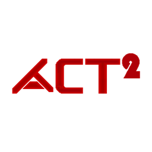

 

 
 
 
 

# ActX
ActX is a eaglercraft-client based on a curseforge mod ACT made by ATE48. While it's a remake and not trying to port it  there's more than just the curseforge mod.
# Installing the client.
1. Download the client (ActX_v1.6.2_WASM-GC*.html) and play it from [Github Releases](https://github.com/Numberoneguy/ActX/releases)
2. Have fun with the client-side stuff from ATE48 and more features i added.

# Useful tips

- ehhhh
- ehhhh 1
- ehhhh 2
- ehhhh 3
